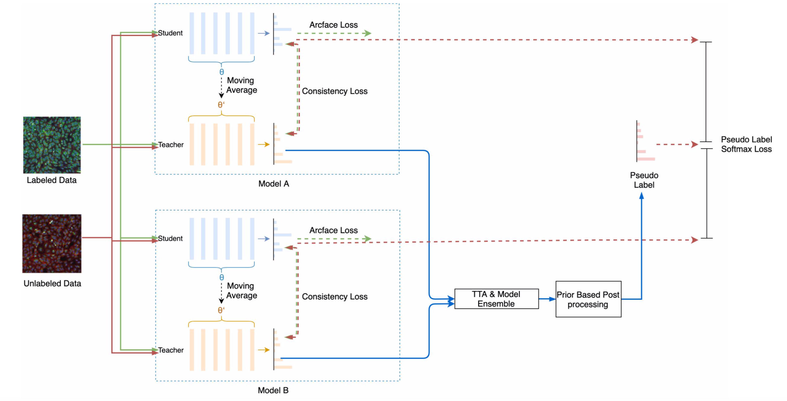

# Recursion Cellular Image Classification Challenge 2019 2nd place code

## Solution Overview


#### Dependencies
- imgaug == 0.2.8
- opencv-python==3.4.2
- scikit-image==0.14.0
- scikit-learn==0.19.1
- scipy==1.1.0
- torch==1.0.1.
- torchvision==0.2.2

## Solution Development

#### Input and preprocessing:
- 6 channel input, image size 512*512
- per image standardization: normalization of 6 channels in images per plate, with small randomization
- augmentation: random flip, random rotation multiple of 90 degrees.

#### Backbone CNN:
- Xception and Xception_large;
- Xception is trained from imagenet pretrained weights.
- Xception_large is trained from srcatch which need more trainning epochs.

#### Loss fuction:
- Arcface Loss s=30, m=0.1: 


#### Path Setup
Set the following path to your own in ./setting.py
```
data_dir = r'your-own-path/recursion-cellular-image-classification'#data path
```

#### Single Model Training
pretrain xception_large 512x512 fold 0 with all cell types：
```
CUDA_VISIBLE_DEVICES=0,1,2,3 python main.py --mode=pretrain --model=xception_large --image_size=512 --fold_index=0 --batch_size=64
```

finetune xception_large 512x512 fold 0 on each cell type：
```
CUDA_VISIBLE_DEVICES=0,1,2,3 python main.py --mode=semi_finetune --model=xception_large --image_size=512 --fold_index=0 --batch_size=64
```

predict xception_large 512x512 fold 0 model：
```
CUDA_VISIBLE_DEVICES=0,1,2,3 python main.py --mode=infer --model=xception_large --image_size=512 --fold_index=0 --batch_size=64
```

#### generate prediction

```
python ensemble.py
```


